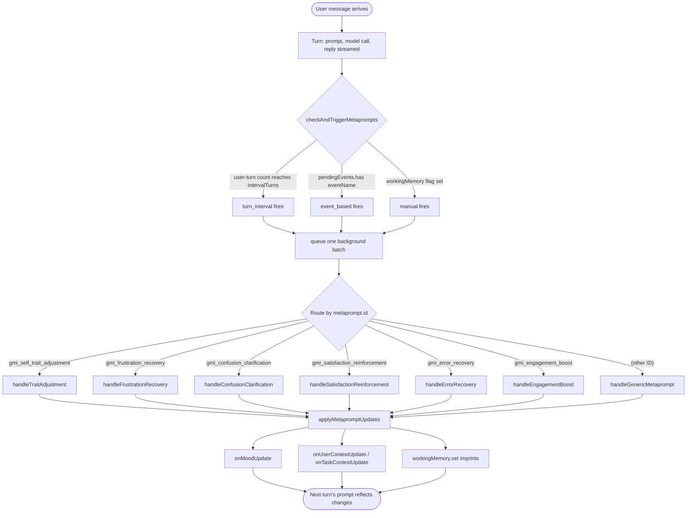

# Adaptive Prompt Intelligence

Every turn, a GMI on the full AgentOS runtime reassembles the system prompt in local code from its current state. That reassembly is template merging and criteria matching, with no LLM call. Metaprompts are a *separate*, *conditional* loop that runs on top: on most turns, nothing fires. When a trigger does fire (every Nth turn for periodic self-reflection, on a SentimentTracker event, or on a host-set flag), one extra LLM call per fired metaprompt runs in the background once the turn's response has streamed and writes back changes to mood, inferred user skill, task complexity or working-memory imprints. The next turn's prompt assembly then picks the persona's contextual prompt elements whose criteria match the new state.

The agent stays the same persona; how it sounds, what it remembers, and how confidently it speaks evolve across the messages where triggers actually fire.

The dollar math, in one line: sentiment scoring is the one adaptive surface that runs on *every* user turn once it is enabled, and the runtime's utility AI decides whether it costs an LLM call, not `sentimentTracking.method`: the default `LLMUtilityAI` makes one call per scored user turn, and a second one when its reply is not valid JSON and it asks for a repair, while a `StatisticalUtilityAI` (or a `HybridUtilityAI` with a statistical part) scores with a lexicon at no cost. Contextual elements cost nothing extra. A metaprompt costs one call each time its trigger fires, and a repair call when its reply is not valid JSON: every `intervalTurns` user turns (every turn with `intervalTurns: 1`), on a sentiment event, or on a host-set flag. See [Operational notes](#operational-notes) below for a concrete per-1000-turn cost table.

![Adaptive Prompt Intelligence: per-turn assembly loop on top (user message → PromptEngine.assemble → MetapromptExecutor.checkAndTriggerMetaprompts → state updates → LLM call); three trigger lanes in the middle (turn_interval periodic self-regulation, event_based SentimentTracker-driven, manual host or tool-driven flags); and the five state surfaces at the bottom (GMI mood, user context, task context, working-memory imprints, HEXACO traits) that metaprompts mutate via callbacks and that re-enter the next turn's prompt.](/img/diagrams/adaptive-intelligence.svg)

This page is the source-verified map of that loop. Every class, interface, trigger name, and handler ID below corresponds to a real surface in [`packages/agentos`](https://github.com/framerslab/agentos/tree/master). If you only need one mental model: the persona definition is the static contract, and the metaprompt executor is the dynamic editor of the GMI's state turn over turn.

All of it runs inside a GMI, so it applies to the sessions of the full runtime (`AgentOS.processRequest()`), to a GMI a host builds itself, and to the sessions of `agent({ runtime: 'gmi' })`. On that path the `cognition` option turns on sentiment tracking (scored by the lexicon of `StatisticalUtilityAI`, with no LLM call) and picks the sentiment presets: `cognition: 'full'` runs all five, and a `CognitionConfig` names them ([GMIs from agent()](./GMI.md#gmis-from-agent)). It carries preset names only: custom `metaPrompts`, turn-interval and manual metaprompts, the self-reflection metaprompt and contextual elements come from a persona definition, which the examples below are.

```typescript
import { agent } from '@framers/agentos';

const support = agent({
  runtime: 'gmi',
  instructions: 'You are a support agent for a billing product.',
  cognition: { sentiment: true, metaprompts: ['frustration_recovery', 'confusion_clarification'] },
});
```

`agent()` without `runtime: 'gmi'` and `agency()` create no GMI ([GMIs](./GMI.md)), so none of this runs on their sessions.

## What's actually adaptive

Three things change between turns without persona reload, model swap, or operator intervention:

| Surface | Where it lives | What edits it |
|---|---|---|
| **Per-turn system prompt** | Composed by [`PromptEngine.constructPrompt()`](https://github.com/framerslab/agentos/blob/master/src/core/llm/PromptEngine.ts) | `ContextualPromptElement[]` whose [`criteria`](https://github.com/framerslab/agentos/blob/master/src/core/llm/PromptEngine.ts) match the current [`PromptExecutionContext`](https://github.com/framerslab/agentos/blob/master/src/core/llm/IPromptEngine.ts) |
| **GMI state** (mood, user context, task context, working memory) | The [`GMI`](https://github.com/framerslab/agentos/blob/master/src/cognition/substrate/GMI.ts) coordinator | [`MetapromptExecutor`](https://github.com/framerslab/agentos/blob/master/src/cognition/substrate/MetapromptExecutor.ts) callbacks (`onMoodUpdate`, `onUserContextUpdate`, `onTaskContextUpdate`) and working-memory writes |
| **HEXACO traits** | The GMI's copy of its persona (`personalityTraits`) | The [`AdaptPersonalityTool`](https://github.com/framerslab/agentos/blob/master/src/cognition/emergent/AdaptPersonalityTool.ts) (`adapt_personality`, called by the model). The offline [`PersonaDriftMechanism`](https://github.com/framerslab/agentos/blob/master/src/cognition/memory/mechanisms/PersonaDriftMechanism.ts) computes proposals that nothing applies. |

Each surface has its own latency profile and its own gate. The contextual prompt elements run on every turn and cost nothing extra. Metaprompts run when their trigger fires and cost one extra LLM call each. A trait changes only when the model calls `adapt_personality`, within a per-session budget.

## The shortest useful example

```typescript
import { AgentOS, AgentOSResponseChunkType, type IPersonaDefinition } from '@framers/agentos';

const tutor: IPersonaDefinition = {
  id: 'tutor',
  name: 'Tutor',
  description: 'A patient programming tutor.',
  version: '1.0.0',
  baseSystemPrompt: 'You are a patient programming tutor.',
  defaultProviderId: 'openai',
  defaultModelId: 'gpt-4o-mini',
  sentimentTracking: {
    enabled: true,
    presets: [
      'frustration_recovery',
      'confusion_clarification',
      'satisfaction_reinforcement',
    ],
  },
  metaPrompts: [{
    id: 'gmi_self_trait_adjustment',
    promptTemplate: `Review the recent conversation and decide if any adjustments are warranted.
Evidence: {{evidence}}
Current mood: {{current_mood}}
User skill: {{user_skill}}
Task complexity: {{task_complexity}}

Respond JSON with optional fields: updatedGmiMood, updatedUserSkillLevel, updatedTaskComplexity, adjustmentRationale, newMemoryImprints.`,
    trigger: { type: 'turn_interval', intervalTurns: 5 },
    temperature: 0.3,
    maxOutputTokens: 512,
  }],
};

const agentos = await AgentOS.create({ personas: [tutor] });

for await (const chunk of agentos.processRequest({
  userId: 'user-42',
  sessionId: 'tutor-session-1',
  selectedPersonaId: 'tutor',
  textInput: 'I keep getting confused about recursion.',
})) {
  if (chunk.type === AgentOSResponseChunkType.TEXT_DELTA) process.stdout.write(chunk.textDelta);
}
```

The persona ships with two adaptive surfaces wired up:

1. **`sentimentTracking.presets`** merges three of the five event-based preset metaprompts into the persona when it loads. The [`SentimentTracker`](https://github.com/framerslab/agentos/blob/master/src/cognition/substrate/SentimentTracker.ts) analyzes every user message. It emits `USER_FRUSTRATED` or `USER_SATISFIED` when a turn's score, or a run of turns, crosses a threshold, and `USER_CONFUSED` when the message contains a confusion phrase or the utility AI rates it `neutral` with more than two negative tokens (the event table under [`event_based`](#three-trigger-types) lists each condition). When one fires, the matching preset (`gmi_frustration_recovery`, `gmi_confusion_clarification`, `gmi_satisfaction_reinforcement`) executes and updates the GMI's mood, the inferred user skill level, or the task complexity.
2. **`metaPrompts[].trigger.type === 'turn_interval'`** schedules a periodic self-reflection every five turns. After every five user messages, the GMI calls the model with the last ten conversation messages, the last twenty reasoning-trace entries, and its current mood and context, then applies any returned changes.

Both run without host code. A changed mood, skill level or task complexity reaches the next turn's prompt only through contextual prompt elements whose criteria match it ([ContextualPromptElement](#contextualpromptelement-per-turn-fine-grained-adaptation)). This persona declares none, so the changes stay in the GMI's state and reasoning trace; the [worked example](#worked-example-tutor-that-adapts-across-turns) adds them.

## The metaprompt definition

The full interface lives in [`src/cognition/substrate/personas/IPersonaDefinition.ts`](https://github.com/framerslab/agentos/blob/master/src/cognition/substrate/personas/IPersonaDefinition.ts):

```typescript
export interface MetaPromptDefinition {
  /** Stable identifier. Built-in IDs route to dedicated handlers. */
  id: string;
  /** Human-readable description for tooling and trace logs. */
  description?: string;
  /** The prompt template, with `{{variable}}` placeholders. */
  promptTemplate: string | { template: string; variables?: string[] };
  /** Model override (falls back to persona.defaultModelId, then the GMI's default model). */
  modelId?: string;
  /** Provider override (falls back to persona.defaultProviderId, then the GMI's default provider). */
  providerId?: string;
  /** Max tokens for the metaprompt response. Default 512. */
  maxOutputTokens?: number;
  /** Sampling temperature. Default 0.3 for consistent state edits. */
  temperature?: number;
  /** JSON schema for the response shape (advisory; runtime parses anyway). */
  outputSchema?: Record<string, any>;
  /** Trigger contract — present means active. */
  trigger?:
    | { type: 'turn_interval'; intervalTurns: number }
    | { type: 'event_based'; eventName: string }
    | { type: 'manual' };
}
```

A metaprompt's provider is looked up through the GMI's provider manager. On a GMI with a [completion gateway](./GMI.md#model-calls-through-a-completion-gateway), that manager answers only for the hop serving the turn: when a fallback hop on another provider served the turn, a metaprompt that names the persona's provider finds none, and the failure is recorded in the reasoning trace.

A persona's `metaPrompts?: MetaPromptDefinition[]` is a field of [`IPersonaDefinition`](https://github.com/framerslab/agentos/blob/master/src/cognition/substrate/personas/IPersonaDefinition.ts). The persona loaders merge these with the presets `sentimentTracking.presets` names (see [Built-in presets](#built-in-presets) below); persona-defined entries override preset entries on matching ID.

The template uses `{{variable}}` placeholders that the executor substitutes with values from the running context. Every handler has its own variable set, documented inline alongside the preset definitions in [`metaprompt_presets.ts`](https://github.com/framerslab/agentos/blob/master/src/cognition/substrate/personas/metaprompt_presets.ts). The `gmi_self_trait_adjustment` handler supplies `evidence`, `current_mood`, `user_skill` and `task_complexity`. A placeholder outside the handler's set reaches the model unreplaced. On the response side, `applyMetapromptUpdates` applies `updatedGmiMood`, `updatedUserSkillLevel`, `updatedTaskComplexity` and `newMemoryImprints`; any other field is ignored.

## Three trigger types

[`MetapromptExecutor.checkAndTriggerMetaprompts(turnId, { countTurn })`](https://github.com/framerslab/agentos/blob/master/src/cognition/substrate/MetapromptExecutor.ts) runs once at the end of every turn, after the response has streamed. `countTurn` is `true` only for user messages. For each metaprompt in the persona's merged list, it evaluates the trigger contract and queues any that fire:



The metaprompts that fire on one turn form one batch, and the metaprompts in a batch execute in parallel via `Promise.allSettled`, so one slow handler does not block the others. Batches run in the background, one at a time per GMI, in the order they were triggered, so two batches never race on the same mood or context field. Failures are logged to the reasoning trace and do not block the user-visible response. Metaprompt work never changes the GMI's lifecycle state (`getCurrentState()`), so the next turn can start while a batch is still running.

These three are the only trigger types. A metaprompt with any other `trigger.type` never fires: the executor records one `WARNING` trace entry for it, and [`validatePersona`](https://github.com/framerslab/agentos/blob/master/src/cognition/substrate/personas/PersonaValidation.ts) reports it as `unsupported_metaprompt_trigger`. Validation also reports `invalid_metaprompt_interval` for an `intervalTurns` that is not a number of at least 1, and `unknown_metaprompt_event` for an `eventName` that is not a [`GMIEventType`](https://github.com/framerslab/agentos/blob/master/src/cognition/substrate/GMIEvent.ts) value. All three are warnings, so strict validation marks such a persona `degraded` rather than blocking it, unless `treatWarningsAsErrors` or `blockOnCodes` names the code.

### `turn_interval` — periodic self-regulation

```typescript
{ trigger: { type: 'turn_interval', intervalTurns: 5 } }
```

The executor keeps a per-metaprompt counter at `workingMemory.set('metaprompt_turn_counter_<id>', N)`. Each user turn (a `TEXT` or `MULTIMODAL_CONTENT` input) increments the counter of every `turn_interval` metaprompt; when a counter reaches `intervalTurns`, that metaprompt fires and its counter resets to zero. With `intervalTurns: 5` it fires on user turns 5, 10, 15 and so on. Tool continuations, system messages and tool-response turns do not count. An `intervalTurns` that is not a number of at least 1 never fires, and the executor records one `WARNING` trace entry for it. Counters are scoped per metaprompt ID, so two different `turn_interval` definitions on the same persona run on independent cadences.

The canonical `turn_interval` metaprompt is `gmi_self_trait_adjustment`. Its handler ([`handleTraitAdjustment`](https://github.com/framerslab/agentos/blob/master/src/cognition/substrate/MetapromptExecutor.ts)) gathers the last ten conversation messages, the last twenty reasoning-trace entries, the current mood, user context, and task context, then submits all of them as evidence to the metaprompt's template. The expected JSON response shape is the same shape `applyMetapromptUpdates` consumes:

```typescript
{
  updatedGmiMood?: string;
  updatedUserSkillLevel?: string;
  updatedTaskComplexity?: string;
  adjustmentRationale?: string;
  newMemoryImprints?: Array<{ key: string; value: any; description?: string }>;
}
```

Periodic self-reflection covers steady-state adaptation. It is the loop that lets a tutor agent realize across multiple turns that the user is actually advanced, not beginning, and re-tune its complexity assumption upward.

### `event_based` — SentimentTracker-driven

```typescript
{ trigger: { type: 'event_based', eventName: GMIEventType.USER_FRUSTRATED } } // the value 'user_frustrated'
```

Event-based metaprompts fire when the GMI's pending-events set contains the named event. `eventName` takes a [`GMIEventType`](https://github.com/framerslab/agentos/blob/master/src/cognition/substrate/GMIEvent.ts) value (`'user_frustrated'`), not the member name (`'USER_FRUSTRATED'`); `GMIEventType` is exported from `@framers/agentos/cognition/substrate`. The pending-events set is owned by the GMI and populated by the [`SentimentTracker`](https://github.com/framerslab/agentos/blob/master/src/cognition/substrate/SentimentTracker.ts). Each turn, after the metaprompt executor consumes an event, it removes the event from the pending set so the same event does not fire twice for the same trigger.

The SentimentTracker emits five of the [`GMIEventType`](https://github.com/framerslab/agentos/blob/master/src/cognition/substrate/GMIEvent.ts) values, and checks all five on every user turn it scores. Each turn adds one to one counter and resets the other two: `consecutiveFrustration` when the score is below `frustrationThreshold` (default -0.3), `consecutiveSatisfaction` when it is above `satisfactionThreshold` (default 0.3), and `consecutiveConfusion` otherwise, so that counter counts turns whose score falls within the two thresholds. The counters compare scores only; they do not read the polarity the utility AI returns.

| Event (value) | Fires when |
|---|---|
| `USER_FRUSTRATED` (`user_frustrated`) | The turn scores below `frustrationThreshold` with an intensity above 0.6, or `consecutiveFrustration` reaches `consecutiveTurnsForTrigger` (default 2). |
| `USER_CONFUSED` (`user_confused`) | The message contains a confusion phrase (`confused`, `don't understand`, `unclear`, `what do you mean`, `explain`, `clarify`, `huh`, `??`, `doesn't make sense`, `not sure`), or the utility AI rates it `neutral` (its polarity, not the score thresholds) with more than two negative tokens. One message is enough. |
| `USER_SATISFIED` (`user_satisfied`) | The turn scores above `satisfactionThreshold` with an intensity above 0.5, or `consecutiveSatisfaction` reaches `consecutiveTurnsForTrigger` + 1. |
| `ERROR_THRESHOLD_EXCEEDED` (`error_threshold_exceeded`) | Two or more of the last ten reasoning-trace entries are `ERROR` entries. |
| `LOW_ENGAGEMENT` (`low_engagement`) | `consecutiveConfusion` reaches 4 and the user messages among the last five history messages average under 50 characters. |

Sentiment analysis is **opt-in** via the persona's [`sentimentTracking: { enabled: true }`](https://github.com/framerslab/agentos/blob/master/src/cognition/substrate/personas/IPersonaDefinition.ts) config. When `enabled: false` (default), no sentiment analysis runs, none of the five events fires (`ERROR_THRESHOLD_EXCEEDED` included), and `event_based` metaprompts never trigger. Turn-interval metaprompts like `gmi_self_trait_adjustment` continue to fire regardless.

### `manual` — host- or tool-driven

```typescript
{ trigger: { type: 'manual' } }

// The flag lives in the GMI's working memory: the IWorkingMemory a host passes
// as GMIBaseConfig.workingMemory when it builds the GMI.
await workingMemory.set('manual_trigger_<metaprompt_id>', true);
```

Manual triggers are flags in the working-memory store. The executor reads `workingMemory.get('manual_trigger_<id>')` at the end of each turn and fires when the value is truthy, deleting the flag immediately after queueing the metaprompt.

Nothing in the runtime sets these flags. The GMI keeps its working memory private, and on the full runtime `GMIManager` gives each GMI an `InMemoryWorkingMemory` the host never receives, so a manual metaprompt fires for a host that builds the GMI itself and keeps the store it passed in. A metaprompt's `newMemoryImprints` cannot set the flag: keys that hold GMI state, `manual_trigger_*` among them, are skipped.

## Built-in presets

[`metaprompt_presets.ts`](https://github.com/framerslab/agentos/blob/master/src/cognition/substrate/personas/metaprompt_presets.ts) ships five event-based presets covering the most common emotional state transitions:

| Preset ID | Trigger | What the handler edits |
|---|---|---|
| `gmi_frustration_recovery` | `USER_FRUSTRATED` event | Can switch mood to empathetic, lowers task complexity, may downgrade assumed user skill level. |
| `gmi_confusion_clarification` | `USER_CONFUSED` event | Can switch mood to analytical, lowers task complexity, records clarification strategy. |
| `gmi_satisfaction_reinforcement` | `USER_SATISFIED` event | May upgrade skill level, may raise task complexity, can switch mood to curious, creative or focused. |
| `gmi_error_recovery` | `ERROR_THRESHOLD_EXCEEDED` event | Can switch mood to analytical or focused, lowers complexity, records mitigation strategy. |
| `gmi_engagement_boost` | `LOW_ENGAGEMENT` event | Can switch mood to creative or curious, may adjust complexity, records engagement strategy. |

A mood is applied only when it is a [`GMIMood`](https://github.com/framerslab/agentos/blob/master/src/cognition/substrate/IGMI.ts) value: `neutral`, `focused`, `empathetic`, `curious`, `assertive`, `analytical`, `frustrated` or `creative`. The preset templates also suggest `helpful`, `patient`, `careful` and `engaging`; a reply with one of those changes no mood.

A sixth built-in handler `gmi_self_trait_adjustment` is **not** a preset (no preset definition is shipped) but is the canonical `turn_interval` self-reflection handler. Persona authors define their own metaprompt entry with that ID and a `turn_interval` trigger; the executor routes it to [`handleTraitAdjustment`](https://github.com/framerslab/agentos/blob/master/src/cognition/substrate/MetapromptExecutor.ts) automatically. Any metaprompt ID the executor does not recognize falls through to [`handleGenericMetaprompt`](https://github.com/framerslab/agentos/blob/master/src/cognition/substrate/MetapromptExecutor.ts), which provides the full context-variable set and applies the same update shape.

### Enabling presets

```typescript
import type { IPersonaDefinition } from '@framers/agentos';

const supportAgent: IPersonaDefinition = {
  id: 'support_agent',
  name: 'Support Agent',
  description: 'Answers product questions from the docs.',
  version: '1.0.0',
  baseSystemPrompt: 'You are the support agent for Acme.',
  sentimentTracking: {
    enabled: true,
    presets: ['frustration_recovery', 'confusion_clarification', 'error_recovery'],
  },
};
```

The `presets` array names which presets the loader merges into the persona's metaprompt list ([`normalizePersonaDefinition()`](https://github.com/framerslab/agentos/blob/master/src/cognition/substrate/personas/personaNormalization.ts)); `['all']` merges all five. Omitting it, or an empty array, merges none, while sentiment analysis still runs for any custom `event_based` metaprompts the persona defines.

### Overriding presets

A persona's `metaPrompts` array takes precedence over presets when IDs match. The persona's entry replaces the preset whole, so an override of the frustration-recovery template restates its trigger:

```typescript
const custom: IPersonaDefinition = {
  ...supportAgent,
  metaPrompts: [{
    id: 'gmi_frustration_recovery',
    promptTemplate: `Custom frustration-recovery prompt for this product domain.
Evidence: {{recent_conversation}}
Errors: {{recent_errors}}
Respond JSON: { updatedGmiMood, adjustmentRationale, recoveryStrategy }.`,
    trigger: { type: 'event_based', eventName: 'user_frustrated' },
    temperature: 0.3,
  }],
  sentimentTracking: { enabled: true, presets: ['frustration_recovery'] },
};
```

The merge logic ([`mergeMetapromptPresets()`](https://github.com/framerslab/agentos/blob/master/src/cognition/substrate/personas/metaprompt_presets.ts)) puts presets in first, then overlays persona-defined entries on top. The override keeps the same handler routing (still `handleFrustrationRecovery` because the ID matches) but uses the persona's template, model, and provider settings.

## SentimentTracker

[`SentimentTracker.ts`](https://github.com/framerslab/agentos/blob/master/src/cognition/substrate/SentimentTracker.ts) is the GMI collaborator that runs before metaprompt evaluation and decides which events to emit. Configuration is on the persona at [`sentimentTracking: SentimentTrackingConfig`](https://github.com/framerslab/agentos/blob/master/src/cognition/substrate/personas/IPersonaDefinition.ts):

```typescript
sentimentTracking: {
  enabled: true,
  method: 'lexicon_based' | 'llm' | 'trained_classifier',
  modelId: 'gpt-4o-mini',
  providerId: 'openai',
  historyWindow: 10,
  frustrationThreshold: -0.3,
  satisfactionThreshold: 0.3,
  consecutiveTurnsForTrigger: 2,
  presets: ['frustration_recovery', 'confusion_clarification'],
}
```

| Field | Effect |
|---|---|
| `enabled` | Master switch. Default `false`. No sentiment analysis, no event emission when off. |
| `method` | Passed to the runtime's utility AI, and neither built-in utility AI reads it. The runtime's default `LLMUtilityAI` classifies every scored turn with one LLM call (~500-1000ms, costs tokens) on `modelId`, else the persona's `defaultModelId`. A `StatisticalUtilityAI`, or a `HybridUtilityAI` with a statistical part, set as the runtime's `utilityAIService`, runs a lexical scan (~10-50ms, no LLM cost). |
| `historyWindow` | Sliding window of recent sentiment scores kept in `workingMemory.gmi_sentiment_history`. Larger windows catch slower trends; smaller windows react faster. |
| `frustrationThreshold` / `satisfactionThreshold` | Score thresholds below/above which a single turn counts toward the consecutive counter. |
| `consecutiveTurnsForTrigger` | How many consecutive matching turns before the event fires. Prevents over-triggering on outlier messages. |
| `presets` | Which preset metaprompts to merge when the persona loads; `['all']` merges all five, and none are merged when it is omitted or empty. |

The sentiment history record persists between turns and survives GMI rehydration via working memory. The `consecutiveFrustration`, `consecutiveConfusion`, and `consecutiveSatisfaction` counters are the values the preset handlers consume as `{{consecutive_frustration}}` etc. in their templates.

## State surfaces metaprompts can mutate

[`applyMetapromptUpdates(updates, metapromptId)`](https://github.com/framerslab/agentos/blob/master/src/cognition/substrate/MetapromptExecutor.ts) consumes the parsed JSON response, routes mood, skill level and task complexity to the matching GMI callback, and writes imprints to working memory:

```typescript
// From MetapromptExecutorConfig: the executor changes mood and context through these callbacks.
onMoodUpdate: (mood: GMIMood) => void;
onUserContextUpdate: (updates: Partial<UserContext>) => void;
onTaskContextUpdate: (updates: Partial<TaskContext>) => void;
// Imprints: workingMemory.set(key, value) for each { key, value } in newMemoryImprints.
// HEXACO traits are not a metaprompt surface; only the adapt_personality tool changes them.
```

| Surface | Field name in metaprompt response | Where it surfaces in next turn |
|---|---|---|
| **GMI mood** | `updatedGmiMood` | Matched against `criteria.mood` on the persona's contextual prompt elements; the prompt carries no other mood text. Mood values are lowercased and validated against the [`GMIMood`](https://github.com/framerslab/agentos/blob/master/src/cognition/substrate/IGMI.ts) enum; unknown values are dropped. |
| **User context** | `updatedUserSkillLevel` | Matched against `criteria.userSkillLevel` on contextual prompt elements. |
| **Task context** | `updatedTaskComplexity` | Matched against `criteria.taskComplexity` on contextual prompt elements. |
| **Working memory imprints** | `newMemoryImprints: [{ key, value, description? }]` | Set on working memory via `workingMemory.set(key, value)`. Imprints persist across turns within the session; prompt assembly does not read them. A key that holds GMI state (`currentGmiMood`, `manual_trigger_*` and the like) is skipped. |
| **HEXACO traits** | (Not a metaprompt surface; only the [`AdaptPersonalityTool`](https://github.com/framerslab/agentos/blob/master/src/cognition/emergent/AdaptPersonalityTool.ts) changes them, on the GMI's copy of its persona.) | A GMI does not write traits into its prompt. The cognitive memory manager takes its traits from its own configuration (`traits`) when the host builds it. |

A metaprompt that returns `{ updatedGmiMood: 'EMPATHETIC' }` does not edit the persona definition. It edits the GMI's current mood state, which is a separate field on the running coordinator. Persona reload at next session start resets mood to the persona default. Working-memory imprints are scoped to the session and survive across turns; trait changes from `adapt_personality` last as long as the GMI and are not reloaded into later GMIs.

## ContextualPromptElement: per-turn fine-grained adaptation

A second adaptive surface runs every turn without LLM calls. Personas can declare a list of `ContextualPromptElement[]` and the [`PromptEngine`](https://github.com/framerslab/agentos/blob/master/src/core/llm/PromptEngine.ts) picks the subset whose `criteria` match the current execution context, then injects them into the prompt in the right slot:

```typescript
import { ContextualElementType } from '@framers/agentos';

const persona = {
  contextualPromptElements: [
    {
      id: 'beginner-tone',
      type: ContextualElementType.BEHAVIORAL_GUIDANCE,
      content: 'Use plain language, avoid jargon, and confirm understanding after each concept.',
      criteria: { userSkillLevel: 'beginner' },
    },
    {
      id: 'expert-tone',
      type: ContextualElementType.BEHAVIORAL_GUIDANCE,
      content: 'Be terse. Skip background. Cite specifics by name.',
      criteria: { userSkillLevel: 'expert' },
    },
    {
      id: 'frustrated-error-handling',
      type: ContextualElementType.ERROR_HANDLING_GUIDANCE,
      content: 'When the previous response missed the user\'s intent, acknowledge briefly and offer a concrete alternative.',
      criteria: { mood: 'empathetic' },
    },
  ],
};
```

The criteria evaluator at [`PromptEngine.evaluateCriteria()`](https://github.com/framerslab/agentos/blob/master/src/core/llm/PromptEngine.ts) checks current values against the element's predicate:

| Criterion | Matched against | Where the runtime value comes from |
|---|---|---|
| `mood` | `context.currentMood` | GMI's `currentGmiMood`, edited by metaprompts. |
| `userSkillLevel` | `context.userSkillLevel` | `UserContext.skillLevel`, edited by metaprompts. |
| `taskHint` (substring match) | `context.taskHint` | `TaskContext.domain`. |
| `taskComplexity` | `context.taskComplexity` | `TaskContext.complexity`, edited by metaprompts. |
| `language` | `context.language` | Not set by the GMI, so an element with a `language` criterion never matches on a GMI turn. |
| `conversationSignals` (all must match) | `context.conversationSignals[]` | Not set by the GMI, so an element with `conversationSignals` never matches on a GMI turn. |

The twelve [`ContextualElementType`](https://github.com/framerslab/agentos/blob/master/src/core/llm/IPromptEngine.ts) values decide where a selected element lands. `type` takes the value (`'behavioral_guidance'`), not the member name. `system_instruction_addon`, `behavioral_guidance`, `task_specific_instruction`, `error_handling_guidance`, `ethical_guideline`, `output_format_spec` and `reasoning_protocol` become system prompts (priority 100 unless the element sets `priority`); `user_prompt_augmentation` is appended to the user input; `few_shot_example`, `interaction_style_modifier`, `domain_context` and `assistant_prompt_augmentation` are collected in `customComponents`, which the built-in templates do not render, so they never reach the model. At most ten elements are selected per turn, highest `priority` first. The combined effect is that contextual elements give you cheap, deterministic per-turn changes, while metaprompts give you expensive, LLM-driven multi-turn changes. The two compose: a metaprompt edits the GMI mood, the contextual element matching that mood is then automatically picked up by the next assembly.

## HEXACO trait drift

HEXACO trait mutation is **not** a metaprompt surface. The metaprompt loop edits mood, context, and imprints, all of which are session-scoped or session-resettable. A GMI's traits change only through the `adapt_personality` tool below, and the change lasts as long as that GMI: `GMI.setPersonalityTrait()` replaces the trait on the GMI's own copy of its persona, so other sessions and GMIs created later keep the persona's original values. The cognitive memory manager takes its traits from its own configuration (`traits`) when the host builds it and uses them in encoding strength, working-memory capacity, consolidation and its mechanisms; a GMI's trait change does not reach it. `PersonaDriftMechanism` only proposes changes. A workflow role's `evolutionRules` are a separate path: `GMIManager` applies their trait patches to that agency seat's persona overlay, which it keeps in process memory for the seat.

### [`AdaptPersonalityTool`](https://github.com/framerslab/agentos/blob/master/src/cognition/emergent/AdaptPersonalityTool.ts) (emergent, agent-driven)

[`AdaptPersonalityTool`](https://github.com/framerslab/agentos/blob/master/src/cognition/emergent/AdaptPersonalityTool.ts) is an [`ITool`](https://github.com/framerslab/agentos/blob/master/src/core/tools/ITool.ts) the full runtime registers as `adapt_personality` when `emergentConfig.selfImprovement.enabled` is true in its configuration. The model calls it like any other tool, with a reasoning argument the mutation store records when one is configured:

```typescript
// Tool input shape (the inputSchema in src/cognition/emergent/AdaptPersonalityTool.ts)
{
  trait: 'openness' | 'conscientiousness' | 'extraversion' |
         'agreeableness' | 'honesty' | 'emotionality',
  delta: number,        // signed; positive increases, negative decreases
  reasoning: string,    // non-empty; recorded with the mutation
}
```

Per-session budgets are enforced in code. `selfImprovement.personality.maxDeltaPerSession` (default 0.15) caps the sum of `|delta|` values applied to any single trait across one session. The runtime clamps any delta that would exceed the remaining budget to `remainingBudget * sign(delta)` and sets `clamped: true` on the output. Trait values themselves stay clamped to `[0, 1]`.

This is the emergent self-modification path. The agent decides, with reasoning, that it should be more open or less assertive. The runtime builds the tool itself (`EmergentCapabilityEngine.createSelfImprovementTools()`, registered by [`ToolOrchestrator`](https://github.com/framerslab/agentos/blob/master/src/core/tools/ToolOrchestrator.ts)), so no host-side `new AdaptPersonalityTool(...)` is needed. The tool changes the trait on the calling GMI's copy of its persona. With a storage adapter configured and `selfImprovement.personality.persistWithDecay` on (the default), a [`PersonalityMutationStore`](https://github.com/framerslab/agentos/blob/master/src/cognition/emergent/PersonalityMutationStore.ts) records each mutation; stored mutations are not reloaded into later GMIs.

### `PersonaDriftMechanism` (heuristic, offline)

[`PersonaDriftMechanism`](https://github.com/framerslab/agentos/blob/master/src/cognition/memory/mechanisms/PersonaDriftMechanism.ts) is the ninth cognitive memory mechanism. With `cognitiveMechanisms.personaDrift.enabled` set on the cognitive memory manager, every consolidation run passes its traces to `analyzePersonaDrift()`, which returns up to two bounded trait proposals once there are at least `minTracesForAnalysis` traces. Heuristic only, no LLM call. Source comments document the trait-to-pattern map.

```typescript
// From src/cognition/memory/mechanisms/PersonaDriftMechanism.ts
export interface PersonaDriftConfig {
  enabled: boolean;
  /** Consolidation cycles between drift analyses (default: 5). */
  analysisInterval: number;
  /** Minimum episodic traces since last analysis to trigger (default: 10). */
  minTracesForAnalysis: number;
  /** Maximum absolute trait change per analysis cycle (default: 0.05). */
  maxDeltaPerCycle: number;
  /** Weight high-arousal memories more heavily in pattern detection. */
  emotionalWeighting: boolean;
}
```

Drift is **off by default** (`enabled: false`). Turning it on changes no trait: `ConsolidationPipeline` discards the proposals `onConsolidation()` returns, and `analysisInterval` is not read.

## Worked example: tutor that adapts across turns

```typescript
import { AgentOS, AgentOSResponseChunkType, type IPersonaDefinition } from '@framers/agentos';

const tutor: IPersonaDefinition = {
  id: 'tutor',
  name: 'Tutor',
  description: 'A patient programming tutor.',
  version: '1.0.0',
  baseSystemPrompt: 'You are a patient programming tutor. Confirm understanding after each concept.',
  defaultProviderId: 'openai',
  defaultModelId: 'gpt-4o-mini',

  // Adaptive surface 1: opt-in sentiment with three event-based presets
  sentimentTracking: {
    enabled: true,
    historyWindow: 10,
    consecutiveTurnsForTrigger: 2,
    presets: ['frustration_recovery', 'confusion_clarification', 'satisfaction_reinforcement'],
  },

  // Adaptive surface 2: periodic self-reflection every 5 turns
  metaPrompts: [{
    id: 'gmi_self_trait_adjustment',
    description: 'Periodic self-check on whether the user is who I think they are.',
    promptTemplate: `Review the last few turns of conversation.
Evidence: {{evidence}}
Current mood: {{current_mood}}
Assumed user skill: {{user_skill}}
Assumed task complexity: {{task_complexity}}

If the evidence suggests my assumptions are off, propose updates.
Respond JSON with optional fields:
- updatedGmiMood: one of [neutral, focused, empathetic, curious, analytical, creative]
- updatedUserSkillLevel: one of [novice, beginner, intermediate, advanced, expert]
- updatedTaskComplexity: one of [simple, moderate, complex, advanced]
- adjustmentRationale: brief explanation
- newMemoryImprints: array of { key, value, description } for facts worth keeping.`,
    trigger: { type: 'turn_interval', intervalTurns: 5 },
    temperature: 0.3,
    maxOutputTokens: 512,
  }],

  // Adaptive surface 3: criteria-matched behavioral guidance per turn
  contextualPromptElements: [
    {
      id: 'beginner-pace',
      type: 'behavioral_guidance',
      content: 'Slow down. One concept at a time. Confirm understanding before moving on.',
      criteria: { userSkillLevel: 'beginner' },
    },
    {
      id: 'expert-pace',
      type: 'behavioral_guidance',
      content: 'Skip basics. Lead with the non-obvious part. Cite names of patterns and APIs directly.',
      criteria: { userSkillLevel: 'expert' },
    },
    {
      id: 'empathetic-tone',
      type: 'behavioral_guidance',
      content: 'Acknowledge the difficulty. Offer one concrete next step instead of a list.',
      criteria: { mood: 'empathetic' },
    },
  ],
};

const agentos = await AgentOS.create({ personas: [tutor] });

async function send(textInput: string) {
  for await (const chunk of agentos.processRequest({
    userId: 'user-42',
    sessionId: 'tutor-session-1',
    selectedPersonaId: 'tutor',
    textInput,
  })) {
    if (chunk.type === AgentOSResponseChunkType.TEXT_DELTA) process.stdout.write(chunk.textDelta);
  }
}

// Turn 1: simple question
await send('What is a function?');

// Turns 2-4: user keeps getting it wrong → SentimentTracker emits USER_FRUSTRATED
// → gmi_frustration_recovery fires → mood becomes 'empathetic', complexity becomes 'simple'
// → 'empathetic-tone' contextual element activates for next turn

// Turn 5: gmi_self_trait_adjustment also fires (5-turn interval)
// → may set the skill level to 'beginner' based on accumulated evidence
// → may imprint { key: 'user_struggling_with', value: 'function_basics' }

// Turn 6: tutor opens with acknowledgment + one concrete step (empathetic-tone),
// pitched for a beginner when the skill level is exactly 'beginner' (criteria
// match exact values, so 'novice' matches neither pace element). The imprint
// stays in working memory; the prompt does not include it.
```

Three surfaces, each acting independently: sentiment and metaprompts change the state, and the contextual elements turn that state into prompt text. No host code rewrites between turns. The persona definition is the same.

## Operational notes

### What actually costs money

Most adaptive surfaces add zero extra LLM cost. Only two paths add LLM calls beyond the regular per-turn completion:

| Surface | When it costs | Per-firing cost |
|---|---|---|
| **`PromptEngine.constructPrompt()` (every turn)** | Never. Local template merging + criteria evaluation, no LLM. | $0 |
| **`ContextualPromptElement[]` (every turn)** | Never. Same local assembly pass. | $0 |
| **Sentiment scoring by a `StatisticalUtilityAI` or `HybridUtilityAI` (every turn when enabled)** | Never. Lexical scan in code, ~10-50ms. | $0 |
| **Sentiment scoring by the default `LLMUtilityAI` (every turn when enabled)** | Every user turn. | One small LLM call (~200 in / ~100 out), plus one JSON-repair call when the reply does not parse. |
| **`turn_interval` metaprompt fires** | Once every `intervalTurns` user turns. | One LLM call (~1500 in / ≤512 out at temperature 0.3), plus one JSON-repair call when the reply does not parse. |
| **`event_based` metaprompt fires** | Only when the SentimentTracker emits the matching event (one strong turn or `consecutiveTurnsForTrigger` turns in a row for frustration, one message for confusion; see the event table above). | One LLM call per event, plus one JSON-repair call when the reply does not parse. |
| **`manual` metaprompt fires** | Only when the host writes the trigger flag. | One LLM call, plus one JSON-repair call when the reply does not parse. |
| **[`AdaptPersonalityTool`](https://github.com/framerslab/agentos/blob/master/src/cognition/emergent/AdaptPersonalityTool.ts) invocation** | Only when the LLM decides to call it. Tool body is local (clamping and budget enforcement); no separate LLM call. | $0 (folded into the regular completion's tool-call round). |
| **`PersonaDriftMechanism` analysis** | Every consolidation run while drift is enabled, once `minTracesForAnalysis` (default 10) traces exist; `analysisInterval` is not read. Heuristic only. | $0 |

The defaults out of the box are: sentiment off, drift off, no metaprompts defined. A persona that sets none of these fields adds nothing to the regular per-turn LLM cost.

### Cost math worked out

Concrete example. Take a tutor agent running on `gpt-4o-mini` (Oct-2024 prices: $0.150 per 1M input tokens, $0.600 per 1M output tokens), configured with:

- `sentimentTracking: { enabled: true, presets: ['frustration_recovery', 'confusion_clarification', 'satisfaction_reinforcement'] }`, scored by a `StatisticalUtilityAI`
- One `turn_interval` self-trait-adjustment metaprompt with `intervalTurns: 5`

Over 1000 user turns:

| Item | Calls | Avg in/out tokens | Cost |
|---|---|---|---|
| Regular completions (your existing baseline) | 1000 | varies | (your baseline) |
| Sentiment scan | 0 LLM calls | — | $0 |
| `gmi_self_trait_adjustment` firing every 5 turns | 200 | 1500 in / 400 out | $0.045 + $0.048 = **$0.093** |
| Event-based presets (typical: ~5% of turns trigger an event) | ~50 | 1500 in / 400 out | $0.011 + $0.012 = **$0.023** |
| **Total adaptive overhead** | **~250 extra LLM calls** | | **~$0.12 per 1000 turns** |

Score sentiment with the runtime's default `LLMUtilityAI` instead and you add 1000 small classification calls (~200 in / 100 out each) at ~$0.030 + $0.060 = **$0.09** more per 1000 turns. Swap `gpt-4o-mini` for `gpt-4o` (10x the unit price) and the same overhead becomes ~$1.20 per 1000 turns.

The order of magnitude: with lexicon sentiment and a 5-turn self-reflection cadence, adaptive overhead lands at roughly **5-15% of a turn's regular cost on a cheap model**, **0.5-1.5% on a frontier model**, and **0%** if you disable both surfaces.

### Cost controls

Three knobs change the cost curve directly:

| Knob | Effect |
|---|---|
| `intervalTurns` on the self-reflection metaprompt | Linear. Doubling from 5 to 10 halves the periodic-reflection cost. |
| `consecutiveTurnsForTrigger` on `sentimentTracking` | Reduces frustration and satisfaction firings (confusion fires on a single message). Default 2; raise to 3-4 to require more sustained signal before paying for a recovery metaprompt. |
| `metaPrompt.modelId` per metaprompt | Override the persona's model with a cheaper one for reflection. The presets ship with `modelId: undefined` so they fall back to the persona default, or to the GMI's default model when the persona sets none; setting them to a small model isolates adaptive overhead from your main completion model. |

### Latency

The executor checks triggers at the end of a turn, after the regular completion has streamed, and queues the metaprompts that fire as a background batch. The turn does not wait for the batch's LLM calls, so the user-visible latency on turn N is unaffected. A batch applies its updates when its calls return: a metaprompt firing on turn N shapes the first prompt assembled after that, normally turn N+1, and a slow call can land during a later turn. Batches for one GMI run one at a time, so their updates apply in trigger order. `GMI.shutdown()` waits up to five seconds for a running batch before it closes working memory. Sentiment scoring runs before the turn's first model call and is awaited: a lexicon score adds 10-50ms, and an LLM score (the default `LLMUtilityAI`) delays the reply by one provider round trip.

**Failure modes.** A failed metaprompt is logged to the reasoning trace as an `ERROR` entry and does not block the user-visible reply. When the metaprompt's reply is not valid JSON, [`IUtilityAI.parseJsonSafe()`](https://github.com/framerslab/agentos/blob/master/src/cognition/nlp/ai_utilities/IUtilityAI.ts) asks the metaprompt's model to repair it (the default `LLMUtilityAI` does; `StatisticalUtilityAI` does not repair); when repair fails, the metaprompt applies nothing. An unknown mood value is dropped silently (validated against the [`GMIMood`](https://github.com/framerslab/agentos/blob/master/src/cognition/substrate/IGMI.ts) enum).

**State scope.** Mood, user context, task context, and the metaprompt turn counters live in the GMI's working memory and persist across turns within the session. They reset when the session ends and a new session starts on the same agent. HEXACO trait changes from `adapt_personality` last as long as the GMI; they are not reloaded into later GMIs, and drift proposals are not applied.

**Opt-in everywhere.** Sentiment tracking is `enabled: false` by default. The drift mechanism is `enabled: false` by default. Metaprompts only run if the persona defines them or the runtime merges presets. None of this is implicit. A default persona has no adaptive surfaces wired up beyond the prompt engine itself.

## Where things live

| Concern | Source |
|---|---|
| Metaprompt executor (3 trigger types, 6 handlers + generic) | [`src/cognition/substrate/MetapromptExecutor.ts`](https://github.com/framerslab/agentos/blob/master/src/cognition/substrate/MetapromptExecutor.ts) |
| [`MetaPromptDefinition`](https://github.com/framerslab/agentos/blob/master/src/cognition/substrate/personas/IPersonaDefinition.ts) interface | [`src/cognition/substrate/personas/IPersonaDefinition.ts`](https://github.com/framerslab/agentos/blob/master/src/cognition/substrate/personas/IPersonaDefinition.ts) |
| Five preset metaprompts + merge logic | [`src/cognition/substrate/personas/metaprompt_presets.ts`](https://github.com/framerslab/agentos/blob/master/src/cognition/substrate/personas/metaprompt_presets.ts) |
| SentimentTracker | [`src/cognition/substrate/SentimentTracker.ts`](https://github.com/framerslab/agentos/blob/master/src/cognition/substrate/SentimentTracker.ts) |
| GMI event types | [`src/cognition/substrate/GMIEvent.ts`](https://github.com/framerslab/agentos/blob/master/src/cognition/substrate/GMIEvent.ts) |
| Sentiment configuration shape | [`src/cognition/substrate/personas/IPersonaDefinition.ts`](https://github.com/framerslab/agentos/blob/master/src/cognition/substrate/personas/IPersonaDefinition.ts) ([`SentimentTrackingConfig`](https://github.com/framerslab/agentos/blob/master/src/cognition/substrate/personas/IPersonaDefinition.ts)) |
| Prompt engine + contextual element evaluator | [`src/core/llm/PromptEngine.ts`](https://github.com/framerslab/agentos/blob/master/src/core/llm/PromptEngine.ts) |
| Contextual element types | [`src/core/llm/IPromptEngine.ts`](https://github.com/framerslab/agentos/blob/master/src/core/llm/IPromptEngine.ts) ([`ContextualElementType`](https://github.com/framerslab/agentos/blob/master/src/core/llm/IPromptEngine.ts) enum) |
| Emergent trait mutation tool | [`src/cognition/emergent/AdaptPersonalityTool.ts`](https://github.com/framerslab/agentos/blob/master/src/cognition/emergent/AdaptPersonalityTool.ts) |
| Heuristic offline trait drift | [`src/cognition/memory/mechanisms/PersonaDriftMechanism.ts`](https://github.com/framerslab/agentos/blob/master/src/cognition/memory/mechanisms/PersonaDriftMechanism.ts) |

## Further reading

- [Generalized Mind Instances (GMIs)](/architecture/gmi) for the coordinator class that owns this whole loop.
- [HEXACO Personality](/features/hexaco-personality) for the trait model the drift mechanism mutates.
- [Cognitive Memory](/features/cognitive-memory) for the eight mechanisms that read the trait values the memory manager is configured with.
- [Emergent Capabilities](/features/emergent-capabilities) for the runtime layer that exposes `adapt_personality` and the rest of the emergent tools.
- [Human-in-the-Loop (HITL)](/features/human-in-the-loop) for adding approval gates around emergent mutations like trait adjustments.

---

## References

### Metacognition and self-regulation

- Flavell, J. H. (1979). [*Metacognition and cognitive monitoring: A new area of cognitive-developmental inquiry.*](https://psycnet.apa.org/record/1980-09388-001) *American Psychologist*, 34(10), 906-911. The original framing of metacognition as monitoring + regulation. The metaprompt executor is the AgentOS implementation of the regulation half: an inner loop that watches the outer loop and adjusts.

### Affective state and adaptation

- Russell, J. A. (1980). [*A circumplex model of affect.*](https://psycnet.apa.org/doi/10.1037/h0077714) *Journal of Personality and Social Psychology*, 39(6), 1161-1178. The valence/arousal model the [`GMIMood`](https://github.com/framerslab/agentos/blob/master/src/cognition/substrate/IGMI.ts) enum and sentiment thresholds implicitly assume. Mood transitions follow the same continuous-space intuition.

### Personality structure

- Ashton, M. C., & Lee, K. (2007). [*Empirical, theoretical, and practical advantages of the HEXACO model of personality structure.*](https://doi.org/10.1177/1088868306294907) *Personality and Social Psychology Review*, 11(2), 150-166. The six-factor model both the `AdaptPersonalityTool` and `PersonaDriftMechanism` mutate.

### Agent self-improvement and reflection

- Shinn, N., Cassano, F., Berman, E., Gopinath, A., Narasimhan, K., & Yao, S. (2023). [*Reflexion: Language agents with verbal reinforcement learning.*](https://arxiv.org/abs/2303.11366) arXiv:2303.11366. Per-turn reflection that writes back to the agent's running state is the pattern this page describes; `gmi_self_trait_adjustment` is one concrete implementation.
- Park, J. S., O'Brien, J. C., Cai, C. J., Morris, M. R., Liang, P., & Bernstein, M. S. (2023). [*Generative agents: Interactive simulacra of human behavior.*](https://arxiv.org/abs/2304.03442) arXiv:2304.03442. Periodic reflection over recent memories drives belief and behavior updates. The `turn_interval` trigger and `handleTraitAdjustment` evidence-gathering pattern come from the same lineage.
